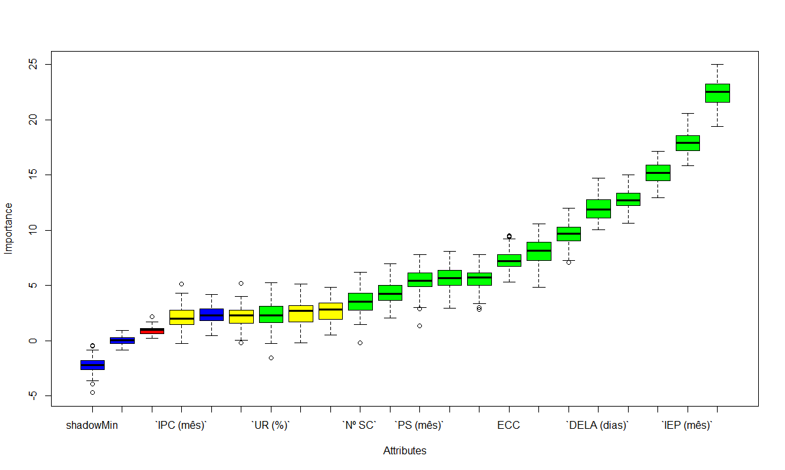

<style>
#sidebar h2 {
    background-color: #186818;
}

h1, h2, h3, h4, h5, h6, legend {
    font-family: Arial, sans-serif;
    font-weight: 700;
    color: #186818;
}
</style>

```{r, message=F, warning=F, echo=F}
knitr::opts_chunk$set(message = F, warning = F, echo=F)
library(shiny)
library(knitr)
library(tidyverse)
library(corrplot)
library(fmsb)
library(stringr)
library(plotly)
source('./00manipulando_dados.R')
source("./01analise_descritiva.R")
source("./01analise_functions.R")
```

# Introdução

```{r, results='asis'}
child_intro <- knitr::knit_child('./relatorio/00intro.Rmd', quiet = TRUE)
cat(child_intro, sep = '\n')  
```

# Análise descritiva

```{r, results='asis'}
child_descritiva <- knitr::knit_child('./relatorio/01descritiva.Rmd', quiet = TRUE)
cat(child_descritiva, sep = '\n')  
```

# Remoção de valores faltantes e divisão dos dados

A fim de obter um conjunto de dados mais fácil de trabalhar, foram eliminadas todas as variáveis com a porcentagem de valores faltantes acima de 40%, além de remover as observações com algum valor faltante. Com isso, a quantidade de observações foi de `r nrow(data)` para `r nrow(data_clean)`, e a quantide de observações de `r ncol(data)` para `r ncol(data_clean)`. 

Além do mais, a fim de treinar os modelos, o banco foi dividio entre um subset de teste e outro de treino em uma proporção 70/30.

# Testes

## Seleção de variáveis

Após selecionar as variáveis relacionadas com a situação do parto pelo método Boruta, temos as seguintes variáveis:

```{r, eval=F}
set.seed(555)
boruta_var <- Boruta::Boruta(`Situação do parto` ~., data=treino)

plot(boruta_var)
```

- Bezerro deste parto
- ECC
- Multiparidade
- PS (mês)
- IEP (mês)
- Nº SC
- PA (Kg/L/lactação)
- DEL (dias)
- PAT (kg/L/lactação)
- PDMT (kg/L/dia)
- DELA (dias)
- ITU
- Temp (ºC)
- UR (%)

```{r, echo=FALSE, out.width="50%"}

```

Com base nisso, é possível realizar os próximos modelos com base em todas as variáveis e somente com as variáveis selecioandas pelo método do Boruta, a fim de verificar a diferença.

```{r, results='asis', eval=T}
child_testes <- knitr::knit_child('./relatorio/02testes.Rmd', quiet = TRUE)
cat(child_testes, sep = '\n')  
```

```{r, context='server'}

```

